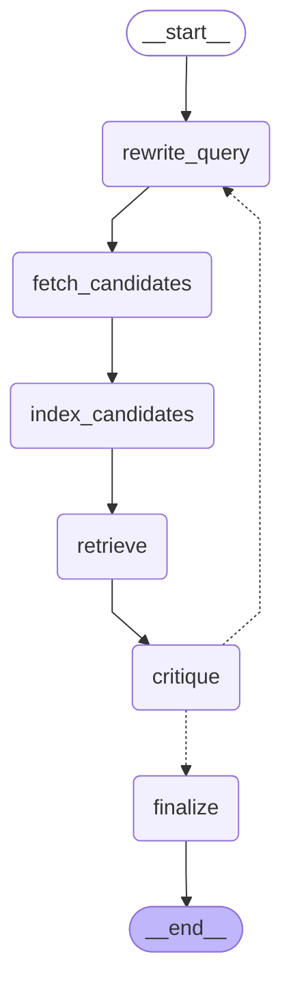

# Agent graph

Generated by `python scripts/draw_graph.py` from `app/graph.py`. Dotted arrows are the conditional edges chosen by `route_after_critique`.

```mermaid
---
config:
  flowchart:
    curve: linear
---
graph TD;
	__start__([<p>__start__</p>]):::first
	rewrite_query(rewrite_query)
	fetch_candidates(fetch_candidates)
	index_candidates(index_candidates)
	retrieve(retrieve)
	critique(critique)
	finalize(finalize)
	__end__([<p>__end__</p>]):::last
	__start__ --> rewrite_query;
	critique -.-> finalize;
	critique -.-> rewrite_query;
	fetch_candidates --> index_candidates;
	index_candidates --> retrieve;
	retrieve --> critique;
	rewrite_query --> fetch_candidates;
	finalize --> __end__;
	classDef default fill:#f2f0ff,line-height:1.2
	classDef first fill-opacity:0
	classDef last fill:#bfb6fc
```
